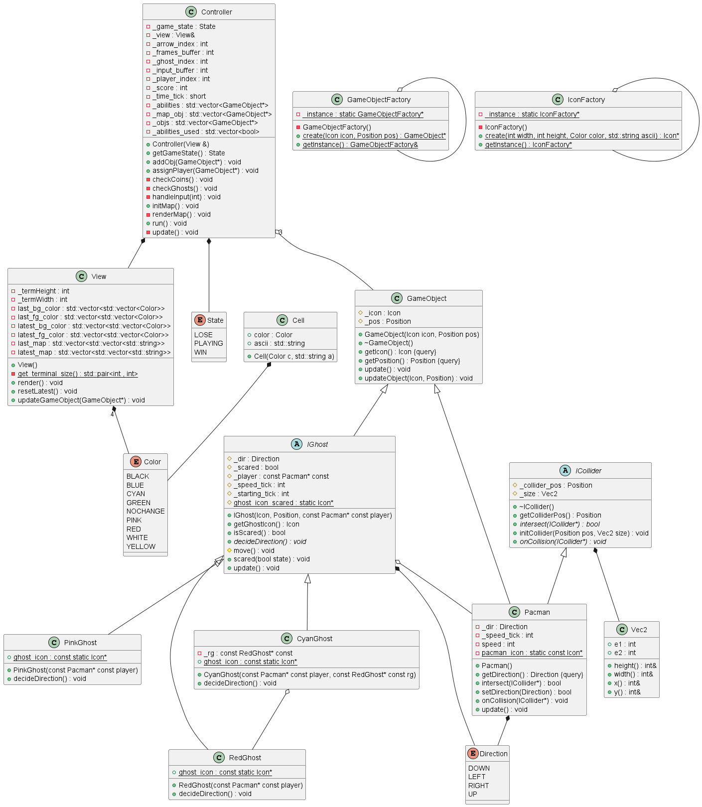
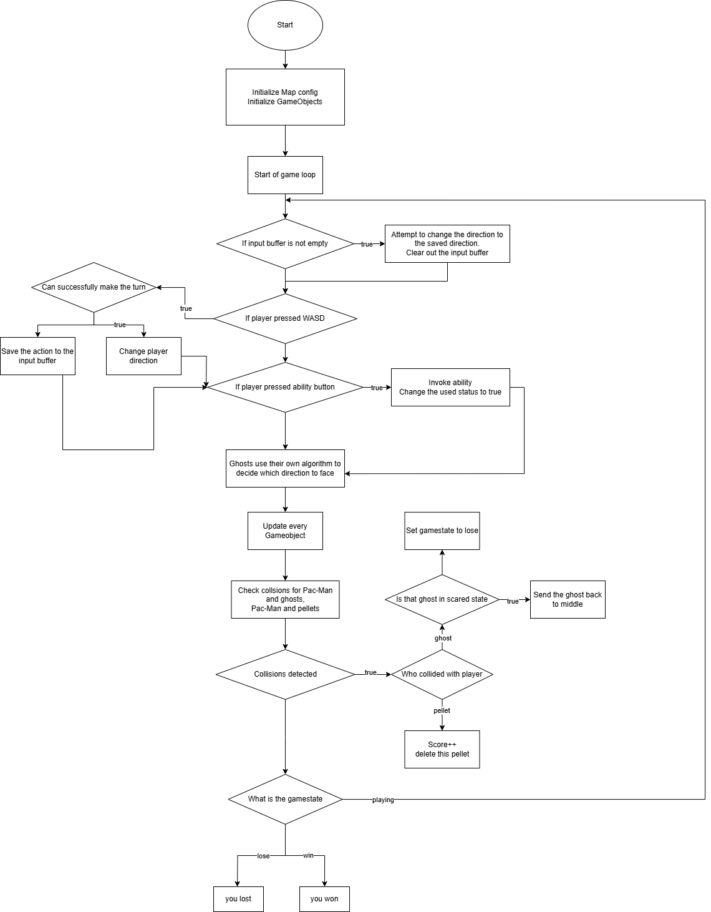

# Pacman
## Game Goal
Eat as many pellets as you can! While avoiding the ghosts which are constanly hunting you.

The Game is over either you've obtained all pellets, or get touched by the ghosts.

## Controls
| key | effects |
| :--: | :--: |
| w  | face up |
| a  | face left |
| s  | face down |
| d  | face right |
| 1  | ability 1 |
| 2  | ability 2 |

## Behaviors
- RedGhost
    - Directly chases Pac-Man's current position
- PinkGhost
    - Aims 4 tiles ahead of Pac-Man's current direction
- CyanGhost
    - Uses a vector between Blinky and a point 2 tiles ahead of Pac-Man
## Abilities
- Power up (press 1) 
    - Turn the ghosts into "scared" mode, which now Pac-Man can eat them and send them back to the center of the map.
    - The ghosts will remain "scared" until Pac-Man eats them, meaning theres no time limit for this mode.
- Flash (press 2)
    - After using this ability, Pac-Man will ignore walls, and teleport at most 4 tiles ahead of its facing direction.

All abilities will replenish every 50 points obtained.

## Class Diagram

## Flow Chart

## Tips 
- Make use of the left-most and right-most tunnel on the map, ghosts cannot use those, and it can quickly make large distance between you and them.
- Use flash thorugh walls to create distance, and use power up when you are surronded.

